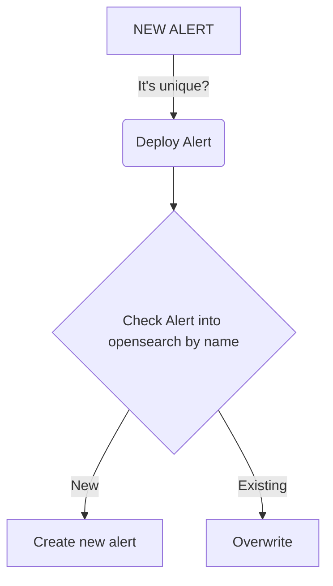

# opensearch-alerting
yes, this is another alert repository for opensearch-alerting. But here you will not only find use cases that can help you enhance your security posture, but I also make public a set of scripts that can be used to build an alert pipeline, using the power of CI/CD, python and the opendistro API. You will be able to manage your alerts (or at least something like that) from git.

#### HOW PIPELINE WORKS?
<div class="center">


</div>

#### HOW TO USE?
This example shows how create a basic match alert with a lucene query. For advance use cases you can reach our the oficial doc: [OPENDISTRO-ALERTING-API](https://opensearch.org/docs/latest/monitoring-plugins/alerting/api/) 

1. Create a new file inside the /alerts folder. (the name of the file must be unique or the pipe is going to fail)
2. Using the following structure, create your yaml for the alert configuration (remember remove the comments and change your settings according)

```yaml 
- name: '### YOUR ALERT NAME'
  type: 'monitor'
  schedule:
    period:
      interval: 5 # interval to monitor
      unit: MINUTES # unit.
  enabled: true
  inputs:
    - search:
        indices:
          - '### yourindex name' # you can use also patters like 'index-*'
        query:
          size: 50
          query:
            bool: 
              must:
                - query_string:
                    query: '### YOUR LUCENE QUERY HERE'
              filter:
                - range:
                    '@timestamp':
                      gte: 'now-60m/m'
                      lte: 'now-5m/m'
                      format: 'strict_date_optional_time'
  triggers:
    - name: 'default_for_each_event'
      severity: '3'
      condition: 
        script:
          source: |
            ctx.results[0].hits.total.value > 0
          lang: painless
      actions:
        - name: '### your action name'
          destination_id: ABC123456789DEF #this destination_id should be the same as the kibana is configured
          subject_template:
            source: '### your action notification summary'
          message_template: 
            source: | # here goes the body mustache message: 
              *event information detail* :
                - *Event ID:* `{{ctx.results.0.hits.hits.0._id}}`
          throttle_enabled: true
          throttle:
            value: 27
            unit: MINUTES
```

3. push the change into the repo and review the pipeline status. (The yaml run some lint before pushing the changes to the opensearch API so you maybe want to run it locally first using python yamllint)

#### TO BE CONSIDERED

- If you want to try something new, I strongly recommend to it over the GUI and then move fw with the pipeline.
- the alerts that are manually created are not sync or managed by this pipeline.
- the destinations must be created before the creation of the alert and its a manual creation over the GUI.
